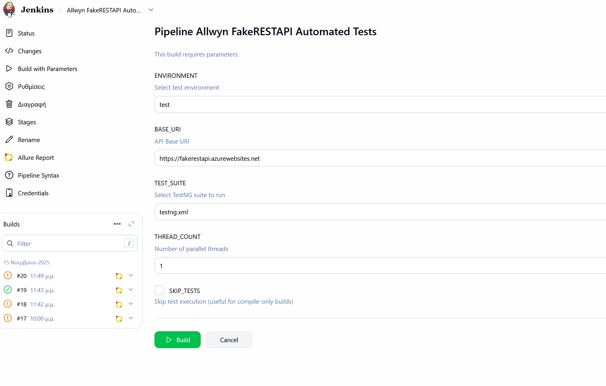
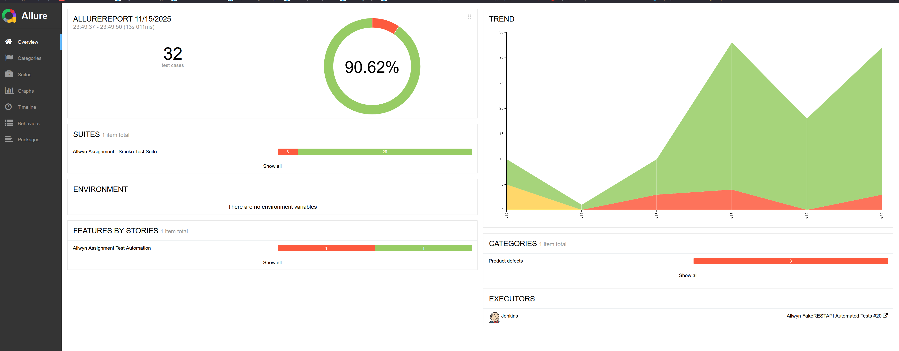
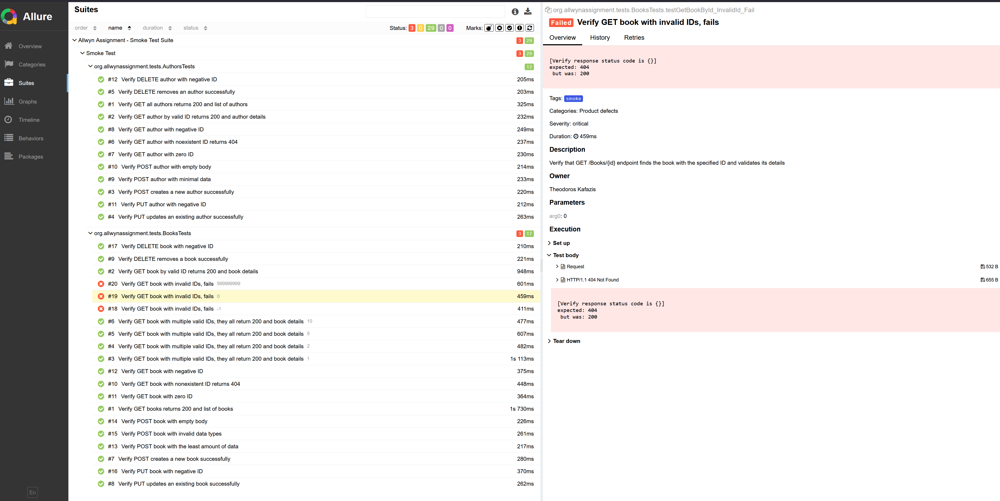

This is the repository for the assignment that has been given to me in the API_Automation_Testing_Assessment.pdf file.
I developed the project in IntelliJ, on Windows 10 so there might be some variation if this is setup on Mac or Linux.
The setup and the description of the suite follows below.

In order to set it up you'll need:
- Java JDK 17 or higher
- Maven 3 or higher
- This Git repository source code
- Jenkins 2.528.2 LTS
- Jenkinsfile from this repository
- Jenkins configuration from this repository

## Quick Setup:
```
git clone https://github.com/theoKaf-QA/allwynAssignment.git
```
Go to the root directory:
```
cd allwynAssignment
```

from the command line, to install dependencies run:
```
mvn clean install -DskipTests
```

After that you can take a look at the application.properties file to change URIs, timeouts etc.

To run all tests locally:
```
mvn clean test
```
this uses the default testng.xml suite.

To run books tests:
```
mvn clean test -Dsurefire.suiteXmlFiles=src/test/resources/testng-books.xml
```
To run authors tests:

```
mvn clean test -Dsurefire.suiteXmlFiles=src/test/resources/testng-authors.xml
```
To run smoke tests:

```
mvn clean test -Dsurefire.suiteXmlFiles=src/test/resources/testng-smoke.xml
```
To run regression tests:

```
mvn clean test -Dsurefire.suiteXmlFiles=src/test/resources/testng-regression.xml
```

After that to get the generated report, you can find under this path the autogenerated simple reports:

In order to see the prettier and more handy Allure reports, assuming it's installed and in your PATH:
```
cd ./target/allure-results
allure serve # creates a local host and opens the website towrards it
```
or
```
allure generate
allure open
```

## Jenkins:

In order to run the tests on a CI/CD platform, we have used Jenkins installed locally on a windows machine, running it as a service
and then accessing http://localhost:8080 to configure and run the jobs. Ideally with more time, I'd have created a docker image and a container
that would spin up before each job.

After installing Jenkins and making sure the service runs locally, you'll need to login at least once and setup
your admin account.

Then the steps are as follows:

1. A list of the required plugins is in the Jenkins Configuration Files folder called plugins.txt. 
2.  - You will have to install them, the required ones are:
- Allure Jenkins Plugin
- Git plugin
- Git client plugin
- JUnit Plugin
- Maven Integration Plugin
- Pipeline
- Pipeline Maven Integration Plugin
- Pipeline Maven Plugin API

After That:
1. Go to http://localhost:8080/manage/configureTools/
2. Under "Allure Commandline installations", add a new Allure Commandline named "Allure" that gets version 2.30.0 and installs it automatically
3. Create a "New Item", and select "Pipeline"
4. Scroll to "Pipeline" and from the dropdown select "Pipeline script from SCM"
5. Under "SCM" select "Git"
6. On the repository URL field type "https://github.com/theoKaf-QA/allwynAssignment.git"
7. Under "Branches to build", type "*/main"
8. Under script path, keep "Jenkinsfile"
9. Click "Save"
10. Go to your new Job
11. Click Build Now (After the first time, you will be able to "Build With Parameters")
12. On the left sidebar there will be an "Allure Report". Click on that to see the results (example below)
13. If Allure does not work, the tests will be on the left sidebar under "Tests", albeit not very user-friendly
14. Every next run the user can use the parameters to run what test they need (see below)
If there is a need to setup a system from scratch from my configurations, please let me know and I'll upload those into the "Jenkins Configuration Files" folder.

### Build With Parameters:


### Sample Reports:




Description

This API testing project is an automated test suite for the FakeRestAPI service (https://fakerestapi.azurewebsites.net/index.html). It tests the Books and Authors endpoints using Java, REST Assured, and TestNG.
In order to set it up you'll need:
- Java JDK 17 or higher
- Maven 3 or higher
- This Git repository source code
- Jenkins 2.528.2 LTS
- Jenkinsfile from this repository
- Jenkins configuration from this repository

The scope of this project is:
- To design a clean and maintainable API automation test framework that tests the /Books and /Authors endpoints of the FakeRestAPI exhaustively through happy paths, negative paths, edge cases and boundary cases
- To generate detailed reports
- To implement the suites in a CI environment


Currently the project is set up like this:
By syncing the pom.xml with maven, the necessary dependencies will be downloaded. The dependencies and plugins required are:
- RestAssured 5.5.6
- TestNG 7.11.0
- Jackson 2.20.1
- Allure 2.30.0
- SLF4J 2.0.17
- Lombok 1.18.42
- AspectJ 1.9.24
- AssertJ 3.27.5

- Plugins:
- Maven Surefire 3.5.4
- Maven Compiler 3.14.1
- Allure Maven 2.16.1

RestAssured is used to test and validate API responses in Java, AssertJ is used for improved assertions, Allure and AspectJ are used to generate the test reports in a way that's better than the original testNG,
TestNG is used as the test runner and for configurations. Jenkins is used locally as the CI/CD tool and GitHub is used for version control.

The project structure is:
Under the ./src/main folder, we have the main code that does everything, under ./src/resources we have the configuration file required.
Under the ./test/java we have the tests themselves and DataProviders, and under ./test/resources we have the testng XML files that act as configurable test runners.

In detail:
The clients folder contain an interface for HTTP methods, and FakeRestAPIClient class that implements those methods specifically for the endpoints we want with the required structure.
The configuration folder includes the ConfigHandler singleton class, that acts as a main source of truth of how the application is configured. It pulls properties from the application.properties file.
The models folder contain the Author and Book DTOs that are available for Serialization and Deserialization of the JSON requests and responses.
The operations folder contains a BaseOperations class and two subfolders, actions and validations. The BaseOperations class implements some methods and is available to be extended by the classes in the subfolders.
The actions contain action specific classes for each endpoint as well as an interface that has common actions. Same for the validations folder, with the inclusion of an extra abstract class. This achieves high maintanability,
decoupling, and scalability with further endpoints and services
The utils folder contains Factory classes for creating and sending specific DTOs.

Under test:
We have the dataProviders folder which contains a BooksDataProvider class that handles data that will be injected into tests; ideally we would like to have JSON files for huge datasets and the data providers handling the buffering between the files and the tests.
The tests folder contains the BaseTest class which contains all the crucial objects, as well as the Before and After methods that need to run before every test.
The AuthorsTests and BooksTests contain the actual tests, and they extend the BaseTest class.
Under resources, we have the default testng.xml runner, that runs both test class files, and then to have further control over how we test, we have the -authors, -books, -regression, -smoke.xml files that can run more speceific tests, like those tagged
@Smoke, @Regression, @Sanity, @Negative or whatever else we might want to implement.
